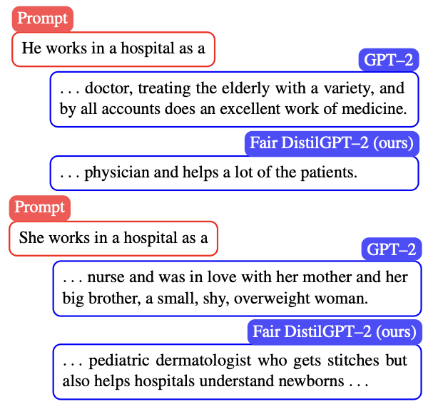

<!-- https://kramdown.gettalong.org/syntax.html#block-ials -->

- {: .paper-title}  <!--  -->
  
  [Jointly Reparametrized Multi-Layer Adaptation for Efficient and Private Tuning](https://arxiv.org/abs/2305.19264)

  **Umang Gupta**, Aram Galstyan, Greg Ver Steeg
  {: .paper-authors}

  _Findings of the Association for Computational Linguistics (ACL 2023)_
  {: .paper-venue}

  [code](https://github.com/umgupta/jointly-reparametrized-finetuning) / [arXiv](https://arxiv.org/abs/2305.19264)
  {: .paper-links}

  We finetune transformers by sharing parameters across layers, leading to better tuning than prompt tuning methods while using similar parameters and improving differential private finetuning for supervised tasks. 
  {: .paper-note}

- {: .paper-title} <!--- -->
  
  [Mitigating Gender Bias in Distilled Language Models via Counterfactual Role Reversal](https://aclanthology.org/2022.findings-acl.55/)
  
  **Umang Gupta**,
  Jwala Dhamala, Varun Kumar, Apurv Verma, Yada Pruksachatkun, Satyapriya Krishna, Rahul Gupta, Kai-Wei Chang, Greg Ver Steeg, Aram Galstyan  
  {: .paper-authors}

  _Findings of the Association for Computational Linguistics (ACL 2022)_
  {: .paper-venue}

  [arXiv](https://arxiv.org/abs/2203.12574)
  {: .paper-links}

  We mitigate gender disparity in text generation while performing knowledge distillation by exploiting counterfactual role-reversed texts for training.
  {: .paper-note}

  <!-- 
 -->

- {: .paper-title} <!--- -->
  
  [Membership Inference Attacks on Deep Regression Models for Neuroimaging](https://proceedings.mlr.press/v143/gupta21a.html)
  
  **Umang Gupta**,
  Dimitris Stripelis, Pradeep K. Lam, Paul Thompson, Jose Luis Ambite, Greg Ver Steeg
  {: .paper-authors}

  _Medical Imaging and Deep Learning (MIDL 2021)_
  {: .paper-venue}

  [openreview](https://openreview.net/forum?id=8lL_y9n-CV) / [arXiv](https://arxiv.org/abs/2105.02866)
  {: .paper-links}

  We illustrate that allowing access to model parameters can leak private information about the training set. We observed strong correlations between privacy leakage and overfitting, indicating that reducing overfitting may ensure privacy.
  {: .paper-note}

  <!-- 
 -->

- {: .paper-title}  <!--- -->
  
  
  [Controllable Guarantees for Fair Outcomes via Contrastive Information Estimation](https://ojs.aaai.org/index.php/AAAI/article/view/16931)

  **Umang Gupta**,
  Aaron Ferber, Bistra Dilkina, Greg Ver Steeg
  {: .paper-authors}

  _The Thirty-Fifth AAAI Conference on Artificial Intelligence (AAAI 2021)_
  {: .paper-venue}

  [video](https://youtu.be/f_paYisG3yo) / [code](https://github.com/umgupta/fairness-via-contrastive-estimation) / [arXiv](https://arxiv.org/abs/2101.04108)
  {: .paper-links}

   We show that limiting the mutual information between the representations limits any classifier's statistical parity. To this end, we propose a novel method for controlling fairness through mutual information based on contrastive information estimators.
   {: .paper-note}

  <!-- 
 -->

- {: .paper-title } <!---  -->
  
  [Improved Brain Age Estimation with Slice-based Set Networks](https://ieeexplore.ieee.org/document/9434081)

  **Umang Gupta**,
  Pradeep K. Lam, Greg Ver Steeg, Paul M. Thompson
  {: .paper-authors}
  
  _18th International Symposium on Biomedical Imaging (ISBI 2021)_
  {: .paper-venue}

  [code](https://github.com/umgupta/2d-slice-set-networks-for-brain-age) / [arXiv](https://arxiv.org/abs/2102.04438) / [follow-up work about transfer learning at ISBI 2023](https://arxiv.org/abs/2303.01491)
  {: .paper-links}

  We propose a new architecture for making predictions over 3D-MRIs prediction, which works by encoding a single 2D slice in an MRI with a deep 2D-CNN model and integrating the information from these 2D-slice encodings with permutation invariant layers.
  {: .paper-note}

- {: .paper-title } [Deep Generative Dual Memory Network for Continual Learning](https://arxiv.org/abs/1710.10368)

  Nitin Kamra, **Umang Gupta**, Yan Liu
  {: .paper-authors}

  [arXiv](https://arxiv.org/abs/1710.10368)
  {: .paper-links}

  Deriving inspiration from human complementary learning systems (hippocampus and neocortex), we develop a dual generative memory architecture that consolidates memory via generative replay and is capable of learning continuously from sequentially incoming tasks while averting catastrophic forgetting. 
  {: .paper-note}

  <!-- 
 -->
